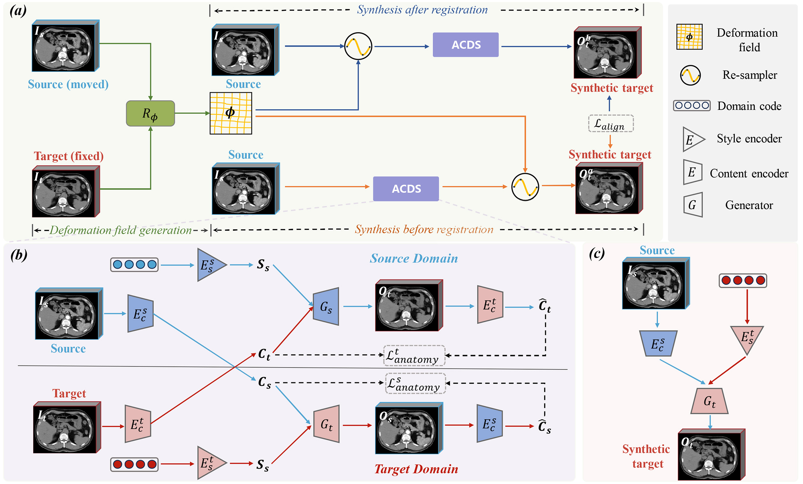

______________________________________________________________________

<div align="center">

# Boosting Misalignment Medical Image Synthesis via Dual-branch Registration-guided and Anatomy Consistency Disentanglement Learning

____________________________________________________________________________________________________________________________________

</div>

## Description

This is the source code for MICCAI paper - "Boosting Misalignment Medical Image Synthesis via Dual-branch Registration-guided and Anatomy Consistency Disentanglement Learning"




## Requirements
_______________________________________________________________________________________________________________________
* python 3.8
* pytorch 1.10
* tensorboardX
* SimpleITK

## Model training
_______________________________________________________________________________________________________________________
```bash
# train on GPU
python train.py --image_dir=/path/to/your/data --max_epochs=200 --lr_max=0.0002
```

## Model evaluation
_______________________________________________________________________________________________________________________
```bash
python test.py --image_dir=/path/to/your/data --checkpoint_dir=/path/to/your/model_results 
```

